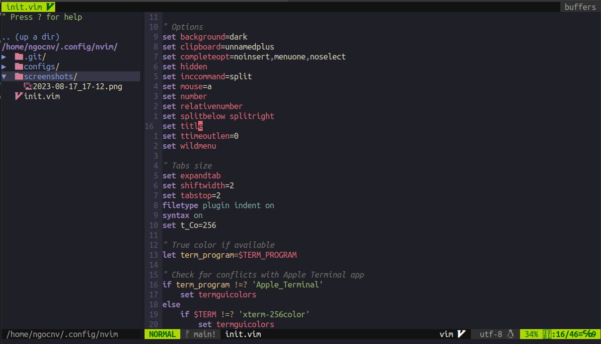

# NeoVim File Configuration

## Preview


## Requirement
- [Vim plug](https://github.com/junegunn/vim-plug)
- Fuzzy finder [fzf](https://github.com/junegunn/fzf)
- [Ripgrep ](https://github.com/BurntSushi/ripgrep)
- [Bat](https://github.com/sharkdp/bat)

## Installation
### Clone repos

```
git clone https://github.com/ngoc24794/vim-dotfiles.git ~/.config/nvim
```

### Installing plugins
Open neovim `nvim` and run `:PlugInstall` command. Find plugins in `configs\plugins.vim` file.

### Key mapping
Find key mapping in `configs\keymaps.vim` file.

### License
MIT